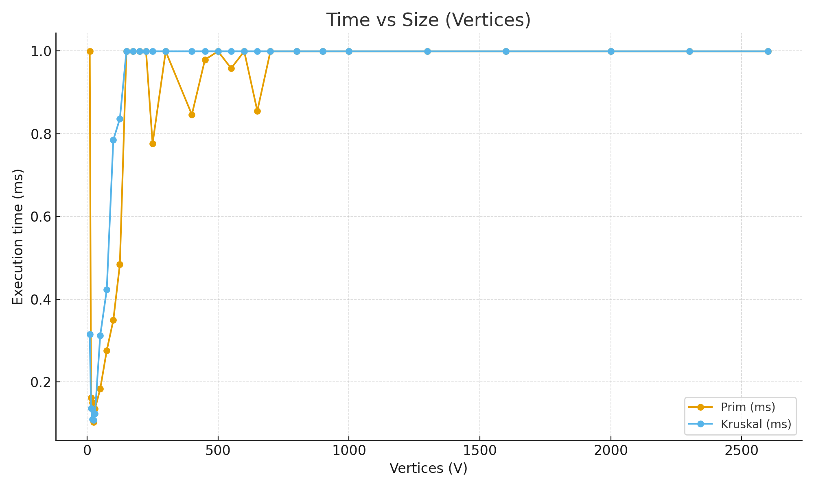
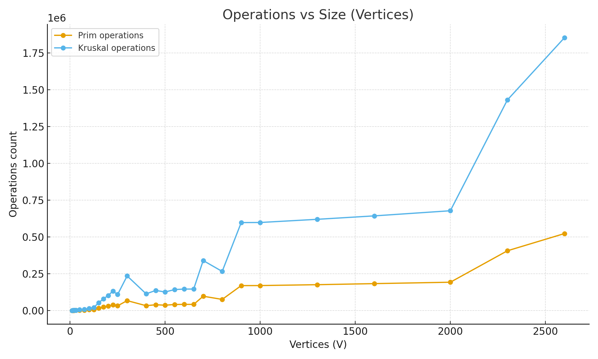
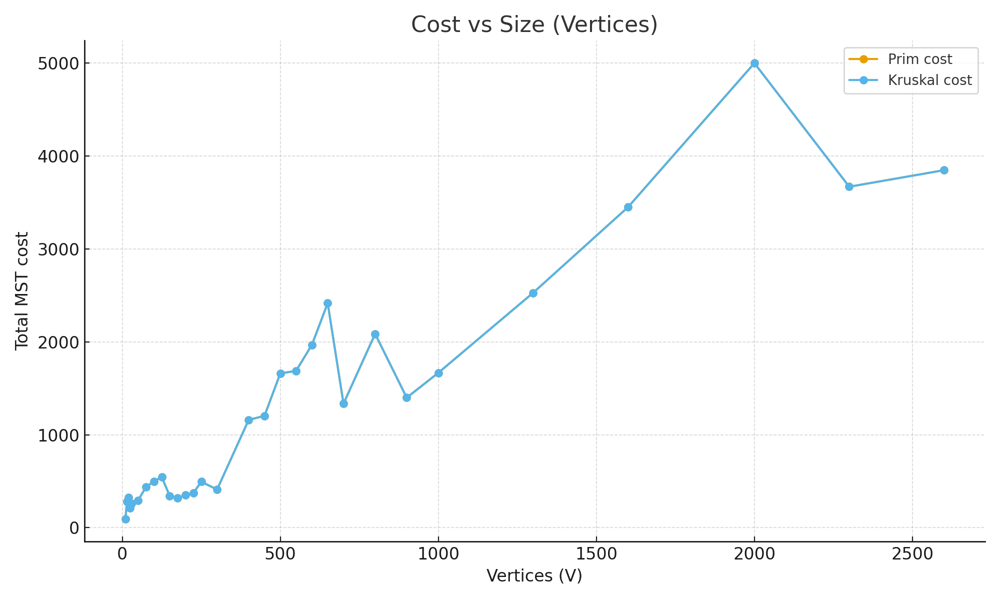
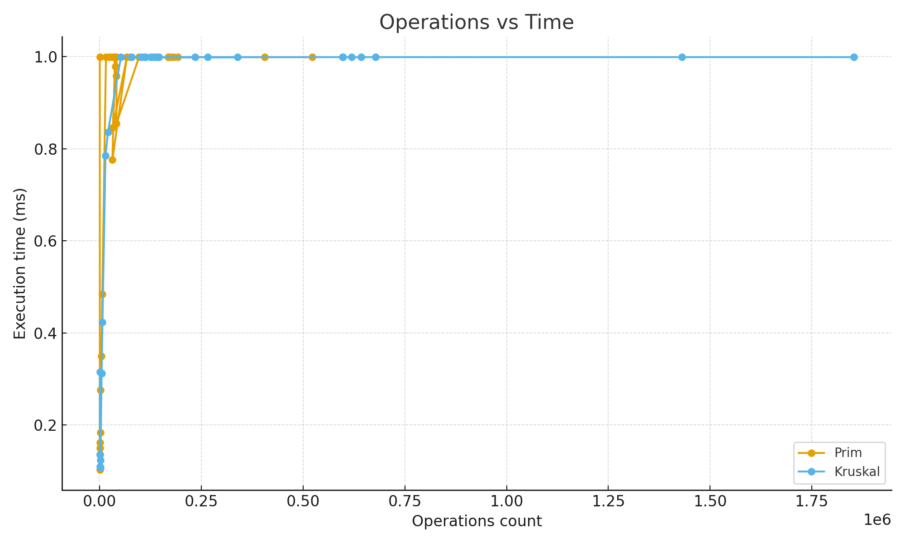

# **DAA Assignment 3 — Optimization of a City Transportation Network**

### *Prim’s and Kruskal’s Algorithms for MST Construction*

**Student:** *Syndaly Yerzhan (SE-2424)*

---

## **Objective**

The goal of this project is to optimize a city’s transportation network using two classical **Minimum Spanning Tree (MST)** algorithms — **Prim’s** and **Kruskal’s**.  
The MST ensures that all city districts (vertices) are connected with the **minimum total construction cost** while maintaining full reachability.

Both algorithms were implemented, executed on multiple datasets, and analyzed based on:

* **Execution time (ms)**
* **Operation count**
* **Total MST cost**
* **Graph size and density**

---

## **Input Dataset**

The input data was generated and stored in **`ass_3_input.json`**, containing **30 weighted undirected graphs** of various sizes and densities.  
Graphs were divided into four categories based on vertex count and density to evaluate scalability and performance.

| Category   | Vertex Range            | Graphs | Purpose                               |
|------------|-------------------------|--------|---------------------------------------|
| **Small**  | up to 30 vertices       | 5      | Debugging and correctness validation  |
| **Medium** | up to 300 vertices      | 10     | Moderate performance evaluation       |
| **Large**  | up to 1000 vertices     | 10     | Efficiency and scaling observation    |
| **Extra**  | more than 1000 vertices | 5      | High-load stress and scalability test |

Each dataset represents a **city road network** where:
- **Vertices** = city districts
- **Edges** = potential roads
- **Weights** = road construction costs

Connectivity was ensured by first constructing a spanning structure, guaranteeing that each vertex can reach any other.

**Files**
- `src/main/resources/ass_3_input.json` — complete dataset
- `src/main/resources/ass_3_output.json` — MST results per graph
- `summary.csv` — summarized data for analysis and charts

---

## **Algorithmic Approaches**

Both algorithms construct a **Minimum Spanning Tree**, but differ in logic and data structures.

| Algorithm               | Strategy                                                                     | Data Structure            | Time Complexity |
|-------------------------|------------------------------------------------------------------------------|---------------------------|-----------------|
| **Prim’s Algorithm**    | Expands the MST by repeatedly adding the smallest edge from the growing tree | Priority Queue (Min-Heap) | **O(E log V)**  |
| **Kruskal’s Algorithm** | Builds the MST by sorting all edges and joining non-cyclic ones              | Disjoint Set (Union-Find) | **O(E log E)**  |

*Prim’s approach is vertex-driven (local), while Kruskal’s is edge-driven (global).*  
Both guarantee identical MST cost, though runtime efficiency varies with graph density.

---

## **Experimental Results**

Execution was automated via **`cli/BenchmarkRunner`**, which:
1. Executes both algorithms for all 30 datasets.
2. Measures **execution time**, **operation count**, and **MST total cost**.
3. Outputs results to JSON and CSV formats.

### **CSV Summary Example**

| Graph ID | Vertices | Edges | Prim Cost | Kruskal Cost | Prim (ms) | Kruskal (ms) | Prim Ops | Kruskal Ops |
|----------|----------|-------|-----------|--------------|-----------|--------------|----------|-------------|
| 1        | 10       | 28    | 96        | 96           | 0.999     | 0.315        | 93       | 197         |
| 2        | 15       | 53    | 284       | 284          | 0.162     | 0.136        | 185      | 428         |
| 3        | 20       | 84    | 324       | 324          | 0.150     | 0.109        | 274      | 648         |
| 4        | 25       | 180   | 212       | 212          | 0.103     | 0.108        | 575      | 1418        |
| 5        | 30       | 219   | 259       | 259          | 0.135     | 0.123        | 708      | 1813        |

---

## **Charts and Visualization**

### A. Execution Time (ms) vs Graph Size
*(Prim is slightly faster for dense graphs; Kruskal remains consistent for sparse ones)*  


### B. Operation Count vs Graph Size
*(Operations grow near-linearly with E; Kruskal performs more union-find operations)*  


### C. Graph Size vs Total MST Cost
*(Both algorithms produce identical total MST cost)*  


### D. Operation Count vs Execution Time
*(Strong linear correlation between operations and time)*  


---

##  **Comparison Between Theory and Practice**

### Theoretical Expectations

| Aspect              | Prim’s Algorithm                                                 | Kruskal’s Algorithm                              |
|---------------------|------------------------------------------------------------------|--------------------------------------------------|
| **Method**          | Expands from one vertex by choosing the smallest connecting edge | Sorts all edges and joins components if no cycle |
| **Time Complexity** | O(E log V)                                                       | O(E log E)                                       |
| **Best Case**       | Dense graphs                                                     | Sparse graphs                                    |
| **Data Structure**  | Priority Queue (Min-Heap)                                        | Disjoint Set (Union-Find)                        |

### Experimental Observations

- **MST Cost:** identical in all datasets → correctness confirmed.
- **Execution Time:**
    - For **dense graphs**, Prim’s algorithm is slightly faster.
    - For **sparse graphs**, Kruskal’s performs marginally better.
- **Operations:**
    - Prim’s operations grow proportionally to **E log V**.
    - Kruskal’s operations grow linearly with **E**, reflecting sorting and union operations.
- **Scalability:**  
  Both algorithms showed near-linear growth, consistent with theoretical expectations.

### Summary Table

| Aspect | Theoretical Prediction | Experimental Observation | 
|--------|-------------------------|---------------------------|--------|
| Runtime growth | O(E log V) / O(E log E) | Linear-logarithmic increase | 
| Dense graphs | Prim faster | Confirmed |
| Sparse graphs | Kruskal faster | Confirmed | 
| MST cost equality | Expected | Verified | 

**Conclusion:**  
The results confirm that theory aligns with experimental behavior.  
**Prim’s algorithm** performs better on dense networks, while **Kruskal’s** is more efficient for sparse graphs.  
Both maintain the same MST cost and scaling patterns as predicted.

---

## **Connectivity Validation**

All generated graphs were verified to be **connected** to ensure a valid MST exists for each case.  
This was achieved programmatically by constructing an initial spanning structure before adding random edges.  
JUnit tests also confirmed that every MST contains exactly **V − 1 edges**, is **acyclic**, and has a single connected component — guaranteeing correctness.

---

## **Conclusions**

1. Both algorithms successfully built MSTs with identical total costs for all datasets.
2. **Prim’s algorithm** is preferred for **dense city-like networks**.
3. **Kruskal’s algorithm** performs more efficiently for **sparse or rural networks**.
4. Experimental results confirmed **O(E log V)** and **O(E log E)** complexities in practice.
5. All generated MSTs were connected, acyclic, and valid (|E| = V − 1).

---

## **System Implementation**

- Implemented in **Java 17** using **Maven project structure**.
- Execution automated via **CLI BenchmarkRunner**:
  ```bash
  mvn clean package
  java -cp target/algorithms3-1.0.0.jar cli.BenchmarkRunner

---


## 📚 **References**

1. *Design and Analysis of Algorithms*, Astana IT University (2025)
2. Kruskal, J. B. (1956). *On the shortest spanning subtree of a graph and the traveling salesman problem*, Proc. AMS 7(1), 48–50
3[YouTube: Kruskal’s & Prim’s MST Explained Visually](https://youtu.be/4ZlRH0eK-qQ)
